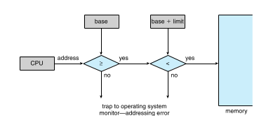
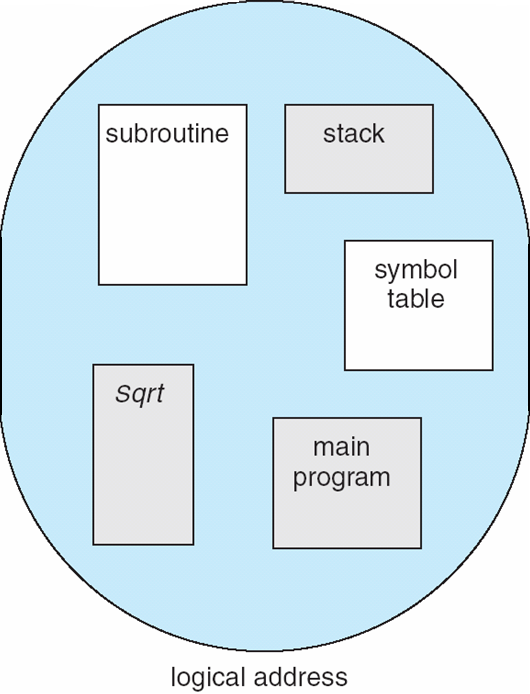
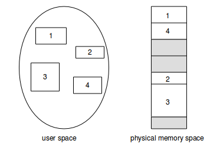

Main Memory - ch7
==================
### Background
Program is brought from disk into memory and placed within a process for it to be run.

CPU can only access main memory and registers. To access disk, CPU has to indirectly run instructions to put disk in main memory or registers.

Memory unit sees everything as a stream. The 2 things that are on this stream are  
  * read requests (contains address to read)
  * write requests (contain address to write to and data to write)

Register access is usually just 1 clock cycle. Main memory is much slower. This can lead to a **stall** where the CPU simply delays executing instructions.

Cache sits between main memory and CPU registers. It serves to make it so that stall time is less.

Protection of memory is required to ensure correct operation

### Base and Limit Registers
The logical address space is made up of **base registers** and **limit registers**. CPU checks every memory access made in user mode to make sure that the address is between the bast and limit for that user.
  * base register - minimum memory address user can access (closer to 0)
  * limit register - maximum memory address user can access (closer to max memory address possible)

  * shows how hardware addresses are protected using the base and limit registers  

### Address Binding
input queue - programs that are on disk and are ready to be brought on disk are put into the input queue
  * if there is no input queue, then the program must be loaded into address 0000
  * it is inconvenient to have first user process physical address always be 0000

Addresses can represented in different ways at different stages of a programs life
  * source addresses are usually symbolic
  * *compiled code addresses bind to relocatable addresses*
    * eg. 14 bytes from start of module
    * this can happen in 3 diff stages - compile time, load time, and execution time
  * *linker or loader will bind relocatable addresses to absolute addresses*
  * each binding maps one address space to another

The compiled code addresses are bound to relocatable addresses at three different stages
  * **compile time**
    * if memory location is known at compile time, then **absolute code** is generated.
  * **load time**
    * if memory location not known at compile time, then must generate **relocatable code**.
  * **execution time**
    * if the process can be moved from one memory segment to another during its execution, then binding is delayed until run time
    * this is where the base and limit registers come in play.

### There are multiple steps that occur when processing a User Program

### Logical vs. Physical Address Space
**logical addresses spaces are bound to physical address spaces**

logical address - generated by CPU. Also called virtual address. The set of all logical addresses generated by a program is called the *logical address space*

physical address - address seen by the memory unit. This is the actual spot in memory where your data is stored. The set of all physical addresses generated by a program is called the *physical address space*.

Compile-time and load-time address binding schemes do not distinguish between logical and physical addresses. Execution-time addressing binding schemes see logical and physical addresses differently.  

### memory-management unit (MMU)
MMU is the hardware device that maps virtual to physical addresses at runtime.

There are many ways(or schemes) to do the mapping.

User program deals with logical addresses only and never sees the real physical addresses
  * execution time binding occurs when reference is made to location in memory

  * A sample simple scheme uses a relocation register which just adds a base value to address
    * physical memory addr = base register + virtual memory addr

A given function is not loaded until it is called. This allows for better memory space utilization because unused functions are never loaded.
  * for this to work, all routines must be kept on disk in a relocatable load format
  * this is especially useful when you have large amounts of code that need to handle infrequently occurring cases. Those infrequent functions don't remain in memory for long
  * another good thing about this is that it does not require special OS support

### Dynamic Linking
**static linking** - system libraries and program code are combined by the loader into the binary program image

**dynamic linking** - linking postponed until execution time
  * **stub** - a small piece of code is used to locate the correct function from memory
    * stub replaces itself with address of the correct function and executes it

OS must check whether the function you are trying to link is in the process's memory address. If it is not, then the OS adds it to the process's address space.

Dynamic linking is especially useful for libraries

### Swapping
A process can be swapped temporarily out of memory to a backing store and then brought back into memory for continued execution.
  * doing this allows for **total physical memory space of processes to exceed physical memory**. This occurs because you can just switch processes in and out of memory

**Backing Store** - fast disk that is large enough to hold copies of all memory images for all users. It must provide direct access to these memory images

**Roll out,roll in** - a type of swapping that is used for priority-based scheduling algorithms. Lower priority process is swapped out so higher priority process can be loaded and executed.

##### swapping is slow

The slow part of swap time is the transfer time. The transfer time is the time it takes to transfer the process between memory and the backing store.

##### swapping in and out

ready queue - queue of ready-to-run processes which have memory images on disk. You can remove these from disk and run them.

The swapped process may not swap back in to the same physical addresses, however, the virtual address will remain the same.

  * this image shows swapping

##### context switch time when swapping
if the next process to be put on CPU is not in memory, then you need to swap out a process and swap in a the target process

The context switch time can be very high

##### swapping when there is IO  
cant swap if a process is pending IO. If you did then the wrong process would get the IO

A way to get around this problem is to transfer IO to kernel space and then to IO device. The kernel would therefore alert the user process that IO has come in.
  * called *double buffering*

### Fixed/Static Partitioning
**Fixed/static partitioning** is when you divide memory into several fixed-sized partitions.
  * Each partition may contain exactly one process.
  * This is still a **multiple-partition method** because you have multiple partitions.
  * When a partition is free, a process is selected from the input queue and is loaded into the free partition.
  * When the process terminates, the partition becomes available for another process.
  * The OS keeps a table indicating which parts of memory are available and which are occupied.

### Contiguous Memory Allocation
Main memory must support both OS and user processes

There is a limited amount of memory so you have to allocate it efficiently. Contiguous Memory is one early method to do this efficiently.

Contiguous memory divides the memory into 2 partitions
  * memory for the OS is held in low memory addresses. This is also where interrupt vector table is held
  * user processes are held in high memory address.  
  * each process is contained in a single contiguous section of memory

Relocation registers are used to protect user processes from each other and from changing OS code and data.
  * base register contains value of smallest physical address
  * limit register contains range of logical(virtual) addresses
    * each logical address must be less than the limit register
  * MMU maps logical address **dynamically**
  * Because of the base register separating the OS and user code, and because the MMU maps the virtual memory dynamically, the kernel code can be changed around. Kernel code size thus changes. This feature is said to make the kernel code **transient**

### Multiple Partition Allocation
The amount of multiprogramming you can do is limited by the number of partitions you can have. Thus there is **variable-partition** sizes for efficiency. Each partition has the size that the appropriate process needs.

**hole** - block of available memory. holds of various sizes are scattered throughout memory.
  * When a process arrives, it is allocated to a hole that is large enough
  * When the process exits, the partition is freed and combined with any adjacent free partitions.
  * **coalescing**  - combining newly freed memory with adjacent free partitions

  * process 8 exits and creates a hole
  * process 5 arrives and is allocated some space

For this to work, OS must store information about
  * allocated partitions
  * free partitions (holes)

##### Dynamic Storage-Allocation Problem / Solution
Say a process allocation request comes in where the process has size n. You have a list of free holes, but which one do you choose?

Solutions  
* first-fit - allocate the *first* hole that is big enough
  * fastest
* best-fit - allocate the *smallest* hole that is big enough. This requires searching the entire list, unless the list is ordered by size
  * most storage efficient
  * if ordered list, then also decently fast
* worst-fit - allocate the *largest* hole. Requires searching entire list.

### Fragmentation
external fragmentation - allocated memory is stored in non-contiguous locations

internal fragmentation - allocated memory may be slightly larger than requested memory. This size difference is memory internal to a partition but is not being used.

50-percent rule - analysis done on first fit dynamic storage allocation reveals that half of all blocks are lost to fragmentation. This then yields that 1/3 of all blocks may be unusable.

compaction - shuffle memory contents to place all free memory together in one large block
  * this is a way to reduce external fragmentation
  * Compaction is possible only if relocation is dynamic and is done at execution time

Backing store has same fragmentation problems

### Segmentation
Segmentation is a memory management scheme that supports user view of memory

A problem is a collection of segments. A segment can be any of   
  * main program
  * function
  * object
  * local variables, global variables
  * stack
  * arrays
  * symbol table
  * common block

  * this is how user sees a program
  * there is a logical address for each of these things

  * this shows how the segments could be laid out in physical memory

##### Basic Method
##### Segmentation Hardware
### Paging

##### Basic Method
frames -
pages -
page number
page offset
page table

framing table

page sizes are always powers of 2 because ...

##### Hardware Support

registers

page-table base register

translation look-aside buffer (TLB)

TLB miss

wired down

address-space identifiers (ASIDs)

flushed -

hit ratio

effective memory-access time

##### Protection
valid-invalid bit

page table length register
##### Shared Pages

reentrant code (pure code)

### Structure of Page Table

##### Hierarchical Paging

forward-mapped page table

##### Hashed Page Tables
hashed page table

clustered page tables

sparse

##### Inverted Page Tables
##### Oracle SPARC Solaris

### Summary
hardware support -
performance -
fragmentation -
relocation -
swapping -
sharing -
protection

### Topics covered in Lecture
* logical-to-physical address binding including static binding and dynamic binding,
* contiguous memory allocation including fixed/static partitioning and variable/dynamic partitioning,
* garbage collection,
* coalescing, and
* implementation of variable partitioning using a doubly-linked list with tag fields.
* You can also find the materials in the book in chapter 7 (sections 7.1 and 7.3).

* bitmap approach for implementing dynamic/variable partitioning
* the buddy system,
* virtual memory management (paging systems).
* You can also find the materials in the book in chapters 7 and 8 (sections 7.5 and 8.8).

* review project 2

* chapter 8 (virtual memory management) on paging systems.
* sections 7.5, 7.6, 8.1, and 8.2.
