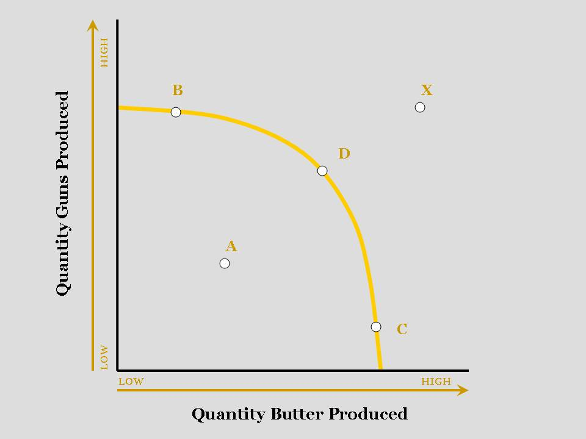

Trade and Specialization
========================

life expectancy, child mortality, and income per capita were all very low until the industrial revolution

Specialization makes people more production. Trade makes people better off.

### Production Possibilities Frontier (PPF)

Shows tradeoff between creating 2 items. In this case guns and butter.
Different regions of the graph
* X - not possible because not enough resources
* B - producing more guns then butter. Would likely want to trade guns for others' butter.
* D - would devote half of resources to Guns, half to Butter
* C - produce lots of butter. Would trade others for guns.
* A - INEFFICIENT. this means not using all your resources properly.

### Comparative Advantage
Opportunity Cost = value of best alternative forgone to make something

Comparative Advantage = being able to produce something with a lower opportunity cost than others.

**individuals and countries should specialize in producing things in which they have a Comparative Advantage**
