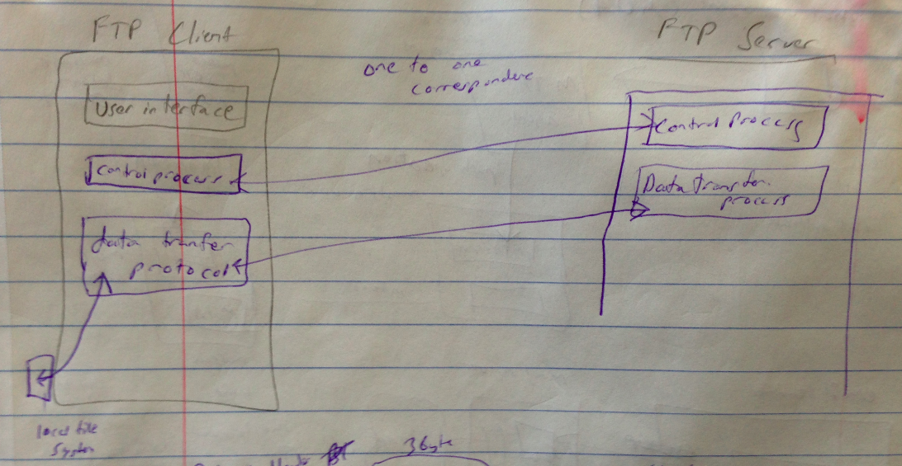
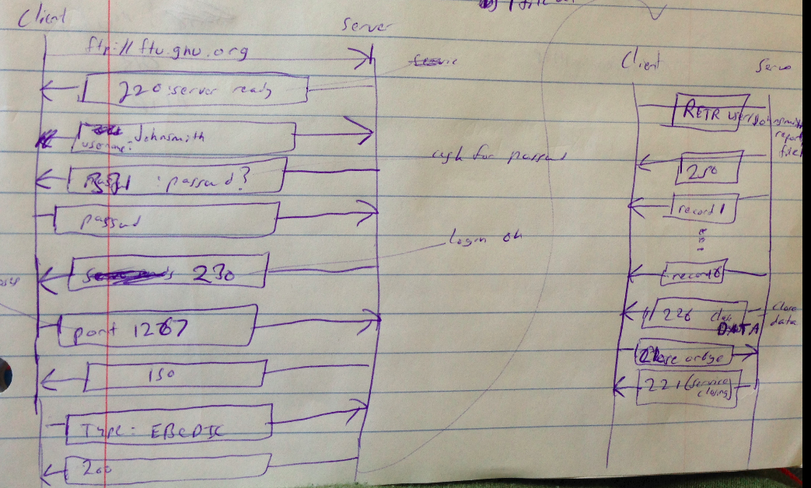
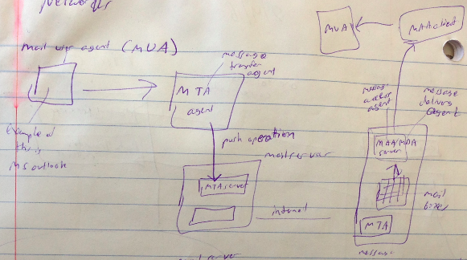

Lecture 5
===============
### FTP (file transfer protocol)
FTP copies remote file from client to a remote server, and vice veras

It is more efficient to use HTTP (v1.1) than FTP to transfer files. This is true because after each request, the connection is closed. HTTP actually allows you to either maintain a connection, or simply specify multiple attachments.

Can use regular expression such as * to select multiple files. For example, you can do "mget file*" which means get all files that start with "file"

##### Steps:  
1. client makes request to server
2. server transfers file to you, or send files to server
3. connection is closed

##### methods
* get - download
* put - upload
* mget - get multiple files at once

##### Components

Three components to a FTP client
* user interface - this is the ftp prompt
* control process - exchange commands (rg. USER, PASS, ...)
* data transfer protocol  - handles transferring data

Two components to a FTP server
* control process -
* data transfer protocol handles

there is a *one-to-one correspondence* between the FTP client and FTP server

Steps for transferring a file
1. user uses user interface (ftp prompt) to specify
  * files to send
  * request commands
  * user authentication
2. the command is parsed and sent to control process to establish a connection with the server
3. the data transfer protocol then gets the file from your local computer and sends it to the server

##### Blocks
Files are sent in blocks. A block contains two parts
* block header(3 bytes)
* data

A block header contains
* 1 byte descriptor
* followed by 2 bytes specifying the block size

##### Default ports:
* 20 - data transfer
* 21 - control process

##### Request Commands (made by client):  

|  Command  | Arguments  |  Description  |
|  ---  |  ---  |  ---  |
|  USER  |  user id  |  send user name  |
| PASS  | password  | send password |
| PORT  | port number  | client chooses a port number |
| TYPE | A,E,or I | ascii, EBCDIC, image |
| RETR  | filename(s)  | files to receive |
| STOR | filename(s) | store files |
| STRU | F,R,or P | file, record, or page; stru=set file transfer structure |
| MODE | S, B, C  | stream, block, compressed |

The difference between file, record, or page
* file - entire file. unstructured. Transfer ends with End of File (EOF)
* record - file with records and each record is sent at a time. Transfer ends with end of record
* page -

##### Response Messages are 3-digit codes.
Examples:

|  Code  | Description |
|  ---  |  ---  |
|125|data connection already open, transfer can start |
|150|file status ok|
|200|command ok|
|220|service ready|
|221|service closing|
|230|login ok|
|331|user name is ok|
|425|cannot open data connection|
|500|syntax error (unrecognized command)|

If you get "1xy:posittve preliminary reply"  
If you get "2xy:positive completion reply"   
If you get "3xy:positive intermediate reply"   
If you get "4xy:transient negative completion reply"  
If you get "5xy:permanent negative reply"

##### Examples
ftp>get /usr/user/johnsmith/reports/file1

Things to note
* each type of control information is sent one step at a time. This makes FTP very slow.
* This example is using record STRU (structure) and thus you are sending multiple records
* you send one file at a time, which is also very slow.
* there is a close "handshake," which is weird

### Email

  
Key Ideas
* MUA (Mail User Agent)
* MTA (Message Transfer Agent)
* the mail server has its own 'mail box' of emails
* mails are pushed to your mail server
* mails are stored in your mail server until you pull them
* on the remote message server, there is a MAA/MDA server (message access agent, message delivery agent) which lets your local MUA client know that there is stuff that you can pull from the mail server
* the messages can go either direction. A server can be a client, and a client can be server in a mail system.

2 types of MUA (mail user agent)
* command driven - Examples: elm, pine
* gui based - Examples: Outlook, Eudora(mac and windows), Exchange(windows)

MTA and MUA end up being combined together. This means the same client can both send and receive emails. Examples of this are Express, Outlook, Eudora, Exchange, ...

email address format: local@domain.com  

##### SMTP, POP3, IMAP4
SMTP (outgoing protocol for email)  
POP3 (incoming protocol for email)  
IMAP4 (incoming protocol for email - most popular)

*What is used for what?*   
* MUA -> MTA : SMTP or HTTP (in LAN, WAN)
* MTA -> your email server : SMTP or HTTP
* your email server -> remote mail server : SMTP
* remote mail server -> remote MTA : POP3, IMAP4 or HTTP
* remote MTA -> remote MUA : POP3, IMAP4 or HTTP (in LAN, WAN)

SMTP (simple message transport protocol)Request Commands:

|  Command  | Arguments  |
|  ---  |  ---  |
|  HELO  |  senders hostname (ip address)  |
| MAIL-FROM  | sender of message(email address)  |
| RCPT-TO  | recipient email  |

Response Codes:

|Code| Description |
|---|---|
|211|system status |
|220|service is ready|
|354|start mail input|

Phases to send email
1. establish connection (via transport layer)
2. data transfer
3. connection termination

### MIME (multi purpose mail extensions)
used for sending images, videos, and non-text files

Has its own headers:
* MIME-version: 1.1
* Content-Type: type/subtype
* Content-transfer-encoding:
* Content-id:
* Content-description: explanation of all information given

type of encoding:
* base64 - groups 6 bits at a time and turns it into an ascii character
* quoted-printable

### Default ports
* ssh : 22
* smtp: 25
* http: 80
* https:443
* ftp
  * data transfer : 20
  * control process : 21
