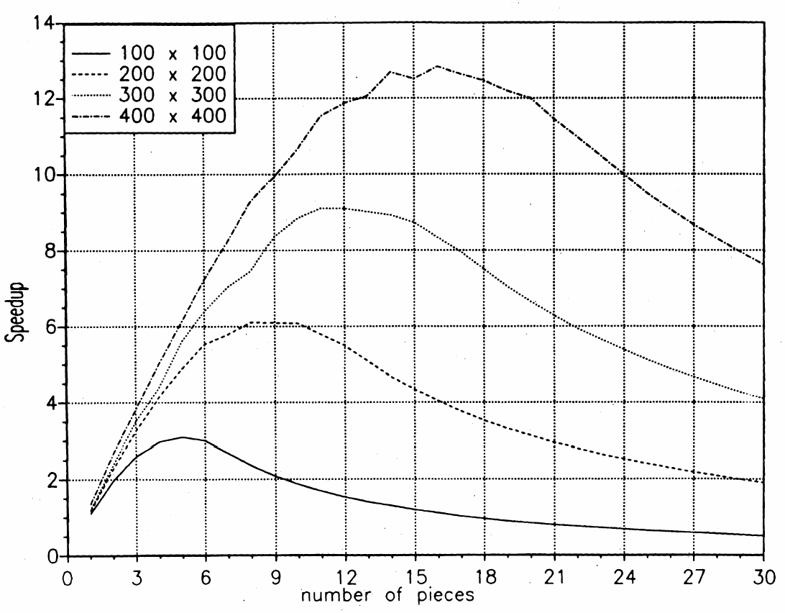

Lecture 14
==========

### Circuit satisfiability
Circuit satisfiability is NP-complete
No known algorithms to solve in polynomial time
We seek all solutions
We find through exhaustive search
16 inputs  65,536 combinations to test

this is pleasingly parallel

##### enhancing the program
we want to find total number of solutions so we incorporate sum-reduction into program

reduction

##### Prototype of  MPI_Reduce()
    int MPI_Reduce (
        void         * operand,
                    /* addr of 1st reduction element * /
        void         * result,
                    /* addr of 1st reduction result * /
        int          count,
                    /* reductions to perform * /
        MPI_Datatype type,
                    /* type of elements * /
        MPI_Op       operator,
                    /* reduction operator * /
        int          root,
                    /* process getting result(s) * /
        MPI_Comm     comm
                    /* communicator * /
    )

HINT: when in doubt, minimize number of scalars
##### MPI datatypes
* MPI_CHAR
* MPI_DOUBLE
* MPI_FLOAT
* MPI_INT
* MPI_LONG
* MPI_LONG_DOUBLE
* MPI_SHORT
* MPI_UNSIGNED_CHAR
* MPI_UNSIGNED
* MPI_UNSIGNED_LONG
* MPI_UNSIGNED_SHORT

##### MPI_Op
* MPI_BAND
* MPI_BOR
* MPI_BXOR
* MPI_LAND
* MPI_LOR
* MPI_LXOR
* MPI_MAX
* MPI_MAXLOC
* MPI_MIN
* MPI_MINLOC
* MPI_PROD
* MPI_SUM

##### call to mpi_reduce

    MPI_Reduce (&count,
            &global_count,
            1,
            MPI_INT,
            MPI_SUM,
            0, //only process 0 will get the result
            MPI_COMM_WORLD);

##### MPI_Barrier
mpi_barrier is the same as barriers with threads. It is used for barrier synchronization.

mpi_wtick - timer resolution

mpi_wtime - current time

these things can be used to get the time

### key things for hw
show time, perfect speed improvement (original time / num processors), and speedup in tables and even charts.

### dynamic self-scheduling
grab things off of a work queue

### Computation Granularity
Message cost
Grain size
Impact of grain size
Tightly coupled versus loosely coupled

### message cost

initial cost to do anything, and then more cost to do more stuff

in real life, there are lots of hardware tricks involved used to speedup work

circuit switched network - hardware establishes path from src -> dst. it creates a fixed routing table from src to dest. Each router in the path is reserved. So no buffering in the network at all.  

packet switched network -

he is trying to show me shape of things. unusual shapes because of how things are being done internally.

jaggies and discontinuties

equation usually only holds on an idle network

As grain size(time spend computing / time spent communicating) shrinks, performance decreases.

As alpha increases, performance goes down.
2 networks can exist in super computer.
  * alphas can be very different between networks
  * not all applications are equally sensitive to alpha
  * if length of message is long, then large alpha affects program a lot.
  * if focus of application is on communication, then large alpha affects program a lot

If we hold the amount of computation fixed and increase the nmber of processors then

### Moral of story
we must balance computation ratio with relative speed of the network and processor

YAGG - larger grain imples less parallelisls

### hw help
if you do it as horizontal blocks(rows), then it is much easier.

iters_per_cell - we  have 2 plates (old,new). he is saying that you do an extra for loop
    the point is to make computations slower. we are trying to make it more granular. observer differences in parameters.  
    for i iterations:
      for ...  <- add this. DO NOT do this extra dumb operation in the most inner for loop else it will.
        do_iter

boundary_thickness - you want extra row from bottom and top of row. Because you will need them from
  ghost cells and boundary cells explained in book
  whether this is a good idea or not is dependent on alpha
    alpha is low on rivanna so less computation is better.

we are doing 1d decomposition

first thing to do is cache block
then,

for iters:
  do communication
  compute

avoid zipper

to change granularity level, change iters_per_cell past 1. 

Ways to make it scream
* asynchronous send and asynchronous receive

### Sample MPI programs
