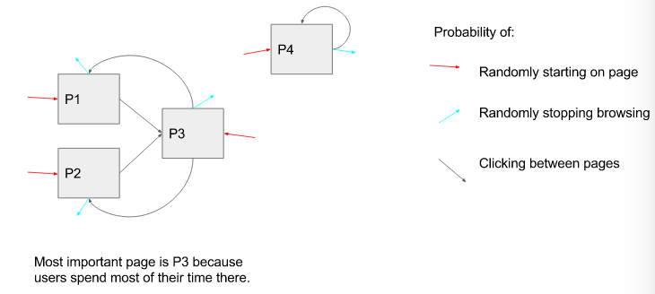

Lecture 11 - Search
===========

### Classical view of Search
Documents have keywords. We query the document for keywords

Search process is two-part: indexing and querying

Indexing Algo:

    index = dict()  # keyword -> document
    for d in documents:
      for kw in d:
        index[kw] = d

Querying Algo:

    results = set()
    for kw in queries:
      results += index[kw]
    return results

### Search in 1970s
Not all keywords are equal.
  * do not want to query for 'the'

Thus, add ranking to the search process. This

Term frequency-i...(TF-IDF)
  * words popularity is important in determining score
  * rare words have higher score

Indexing Algo:

    # score() - gives a score for a word
    index = dict()
    for d in documents:
      for kw in d:
        index[kw] = (d,score(kw,d))

Querying Algo:

    results = dict()
    for kw in queries:
      d,score=index[kw]
      results[d] += score
    return sorted(results.items(), key=lambda x: x[1])

1970s score function:

    # map from (kw,d) -> count of times kw appears in d
    tf = dict()
    # map from kw to what fraction of all known documents contain kw
    df = dict()
    def score(kw, d):
      # tf part is for how often a word appears in a given doc
      # inverse df is for whether the word itself is a common word in general or not.
      # the highest score would appear a lot in a given doc(tf), but be a rare word (inverse df)
      return tf(kw,d) * (1.0-df(kw))

For example:

    d1="the book was good"
    d2="the book gilgamesh is old"
    query="gilgamesh book"

    score d1 for this query:
      score("gilgamesh", d1)+score("book", d1)
      =tf["gilgamesh", d1] * (1-df("gilgamesh")) + tf["book", d1] * (1-df["book"])
      =0 * (1-0.5) + 1 * (1-1)
      =0

    score d2 for this query:
      score("gilgamesh", d2)+score("book", d2)
      =tf["gilgamesh", d2] * (1-df("gilgamesh")) + tf["book", d2] * (1-df["book"])
      =1 * (1-0.5) + 1 * (1-1)
      =0.5

### Google
Google updated the score function to also score the document independently of the keyword
* previous efforts simply gave a higher page to a .gov or .edu

A page with a lot of "high quality" links pointing to it was a "high quality" page. A high quality page would then be linked to other high quality pages.

Score function now is a combiantion of keywords (frequencies) and page importance

    score_google(kw, d) = score_1970(kw, d) + importance(d)

##### PageRank-like model of browsing

#### Ranking and Recall
Useful to split search query processing into 2 components
* recall is fetching all relevant documents for the query. This is more general and fast. Not specific to user or to query.  
* ranking is ordering them so most relevant is first

For example:

    results = dict()
    # compute recall
    for kw in queries:
      d,score = index[kw]
      results[d] += score
    #compute ranking
    return sorted(results.items(), key=lambda x:x[1])

#### Further Complications - bigrams
there are phrases out there where you automatically know what phrase is referring to. For example, "to be or not to be". This is a random sequence of words as per the previous examples. However, it is clearly Shakespeare.

To solve this, index every x words. Not just individual words.
* index size becomes too big too quickly
* thus, index only the frequent n-grams  

Another solution is to index offset of word into document and use those positions in ranking.
* score documents more highly if all the words are near each other

### Search Quality Evalulation
Key questions to ask
* did the relevant documents get returned?
* did best document come first?

#### Evaluation functions

    search_quality(query, search_results) = quality(recall) + quality(ranking)

    quality(recall) = what percent of relevant docs were returned - percent of irrelevent docs returned

    quality(ranking) = was best result in #1 position. was next best in #2 position

#### human evaluation
frequently evaluated by human judgement. you ask humans
* is each result relevant?
* are relevant results missing?
* ordered correctly?

#### Precision vs Recall
Recall - probability correct documents were in the recall set (no false negatives)

Precision - probability only correct documents were in the recall set (no false positives)
