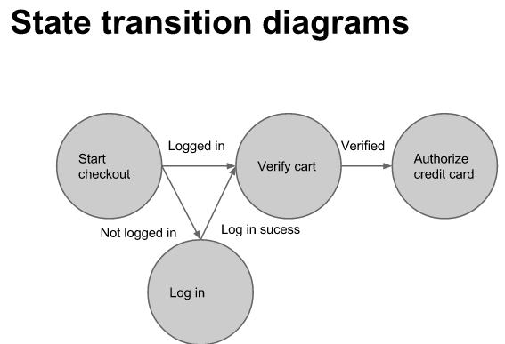

Lecture 3 - Requirements and Specs
============

Things to consider when writing product requirements
* what technology allows?
* cost
* what do customer want?
* what you think is best?
* what differentiates you from competition?

User stories are a way to define user requirements. You think about requirements from a users point of view.
* Format: I, as a <user_role>, want <feature>
* Example: I, as a car buyer, want big car doors.

Architecture and design docs are used by
* engineers to organize thoughts
* testing/QA to develop test plans
* product management to look for disconnects in plan
You should update architecture and design docs to reflect how things are built

Data flow for search engine indexing

This is just an example of how you can go about splitting up documentation. You can build documentation separately for each portion of the data flow. This way, the indexing team will know what to look for in the stemming team.

State Transition Diagrams

Another way to document. Look at all the different states that the user goes through on the website/product and base the user stories on them. When you do not have a state diagram, you usually end up worrying about all varying portions of the project at a single point. For example, you might be writing code for verifying cart and be worried about your code will affect something that happens in log in. Don't. Focus only on what should happen in the verifying cart section.

Data model diagrams

This is very useful to verify if your application works for numerous test cases. For example, say you have some postal application, and you build a data model diagram. You can now check all the features

For design, DRAW PICTURES.
