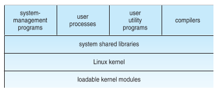

Linux
======
# History
# Design Principles
Linux is multiuser and supports multitasking

Linux is POSIX-compliant

There are three main bodies of code
  * kernel
  * system libraries
  * system utilities

there are two modes - user and kernel. Kernel is more priviliged instructions.

user mode programs has multiple shells, including bash (bourne-again shell)

### kernel
kernel is responsible for maintaining important abstractions of the OS

kernel code executes in kernel mode with full access to all physical resources of computer

all kernel code and data structures are kept in the same address space

### system libraries
system libraries define standard set of functions through which applications interact with kernel

the system libraries functionalities for which you do not need full kernel mode privileges

### system utilities
system utilities perform individual specialized management tasks

# Kernel Modules
kernel modules are sections sections of kernel code that can be compiled, loaded, and unloaded independent of the rest of the kernel.

Common things that kernel modules do are implementing
  * a device driver
  * a filesystem
  * a networking protocol

There is a module interface so that third parties can write and distribute kernel modules themselves.

Kernel modules allow linux system to be setup with standard minimal kernel.

# Process Management
# Scheduling
# Memory Management
# File Systems
# Input and Output
# Interprocess Communication
# Network Structure
# Security
