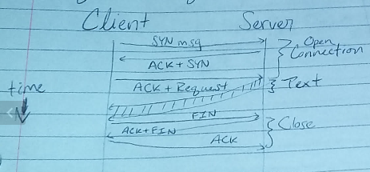

Lecture 4
==================

### Web Documents
* static documents - documents created already. only server can change them. Created using HTML or XML.  
* dynamic documents - documents that change. Used for things like current date, weather. You can use CGI or GSP to create dynamic documents
* active documents - java applets. server sends you something that runs on your client machine.

### HTTP
* Default port is 80
* TCP oriented - supports flow control, error control, congestion control
* non-persistant (prior to v1.1) - once client finishes loading, the session is closed. For each request, a new connection is needed

This image reveals that
1. the original client sends a syn message.
2. The server then sends back a ack+syn.
3. To complete the three-way handshake, the client sends back a ack+request.
4. After all that, the server actually sends the data.
5. Once the data is received, the client sends a fin.
6. The server acknowledges the fine with a ack+fun
7. Finally, an ack by the client ends the entire connection.  

The same thing occurs for an image file.

A key thing to note is that the image request must be made entirely separately. Thus even if the text request and image request, made in succession, are similar, the two requests are made entirely separately.

### HTTP >=v1.1
In HTTP v1.1 and onwards, you can have persistent connections. This simply meant that after the initial 3-way handshake, you can start making continuous data requests without having to do the 3-way handshake (until timeout).

### HTTP Request Format

DIAGRAM

A few examples of headers are
* user-agent - type of client
* date
* cookie  

### HTTP Response Format

### Status codes
|status code|description|
|---|---|
|1xx|informational (continue)|
|2xx|successful request (ok)|
|3xx|direct client to another url|
|4xx|error on client side|
|5xx|error on server side|

Make sure to look at cookies and proxy server notes in ApplicationLayerBook notes

### Make HTTP more secure
There are two ways to make HTTP more secure
* HTTP + SSL
  * certificate authority verifies the html document. SSL also creates a secure connection between sender/reciever
* HTTP + TLS (transport layer security)
  * public key/private key encryption can be used when transporting information
