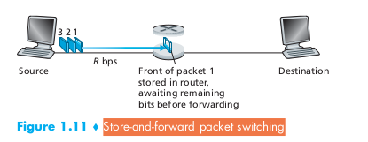
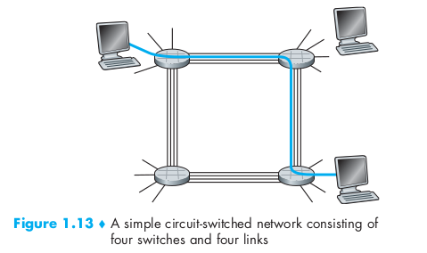

The Network Core
==================
* * *

## Packet Switching
End Systems exchange *messages* with each other. Messages can either send data or control information. Messages are broken down into chunks of data called *packets*.

Packets are sent through *communication links* and *packet switches*.

 Communication links are the physical links such as coaxial cable, copper wire, optical fiber, and radio spectrum. These are very optimal in sending packets across. If the source end system sending a packet of L bits over a link with transmission rate R bit/sec, then the time to transmit is L/R seconds. This is called *full* transmission.

There are two types of Packet Switches - *routers* and *link-layer switches*.   
Most packet switches use *store-and-forward transmission* in which the packet switch stores an incoming packet until all of its bits are stored properly on the switch and only then does it forward the packet to the next switch or end system.

In the above image, the transmission rate is R bit/sec and each packet contains L bits. Thus:

    Transmission rate = R bit/sec
    Each packet contains L bits

    time for a given packet to go from source to router:
    1/R sec/bit * L bits = L/R sec

    time for packet to go from source to destination:
    L/R sec per edge * 2 = 2L/R sec

    if N-1 routers, then there are N edges. Thus time for packet to go from source to destination with N edges is:
    L/R sec/edge * N edges = NL/R sec

    if P packets are sent, then last packet cannot go until P-1 packet has gone. P-1 packet cannot go until P-2 packet has gone... Thus last packet must wait P seconds. The last packet (like any other packet) will take NL/R sec. Thus
    PNL/R sec for P packets to go N-1 routers where each connection takes R bits/sec and each packet carries L bits.

Speed at which packets travel across a network where the routers use store-and-forward packet switching:

* P x N x L / R
* P = number of packets
* N = number of links
    * N-1 routers means N links
* L = bits that each packet carries (bit)
* R = rate at which packets are delivered across a link (bit/sec)

Each packet switch has an *output buffer* (also called *output queue*) which stores packets that the router is about to send into its output links. If an arriving packet needs to be transmitted onto a link but the link is currently busy, then that packet will be put on the output buffer. This additional wait is called *queuing delays*. These delays depend on the level of congestion in the network thus can be highly variable. Therefore, along with the store-and-forward packet switching delays, packets also experience delays due to waiting on the output buffer. In addition, if the output buffer is full, then either the arriving packet or some packet in the output buffer will dropped thus leading to *packet loss*.

To determine which output link to send an incoming packet, packet switches use a *forwarding table*. Each end system on the Internet has an IP address. Each packet has a destination IP address. Thus, a given packet switch can use its forwarding table to determine which output link to send a packet to given its destination IP address. Each packet switch does not know how to get to each destination IP address. It uses a portion of the IP address to determine where to output the current packet to. There are a lot of *routing protocols* that determine how a forwarding table for a given packet switch is determined.

## Circuit Switching

Along with packet switching, data can flow through a network also using circuit switching. In circuit-switched networks, resources needed along a path are *reserved* for the duration of the communication session between the end systems. What this means is that once a link between two end systems is created, resources to transfer the packet along and whatever else is needed by the switches are dedicated to making this transfer of packet work. This key difference can be observed using the output buffer for packet switches (circuit switches do not have an output buffer as described for packet switches above). In a packet switch, when the packet comes in, it may or may not have an available output link. If not, then it is stored in the output buffer. This will not happen for circuit switches. The output link will be *reserved* for the incoming packet so that as soon as it comes in, it can be sent out.

Thus circuit switching requires establishing a proper functioning connection between the sender and the receiver before the data is sent. This connection is called a *circuit*.

Since transmission has been reserved for the sender-to-receiver connection (circuit), the sender can transfer the data at the *guaranteed constant rate*.

In this picture, the top left computer wants to connect to the bottom right computer using a circuit switch. To do so, the two establish a dedicated *end-to-end connection*.

## Compare Packet versus Circuit switching
* circuit switching is more reliable as packets aren't lost simply because of congestion. No packet loss.
* circuit switching wastes resources as the dedicated connection (circuit) does not allow other things to be used while the transfer is occurring. For example, in the picture example above, when the top link is being used to transfer, the right side link is also reserved. The right side link is not being used while the data transfer is only at the top. Thus the right side link is being wasted at that moment.
* Circuit switching is like TCP. Packet switching is like UDP. I have a feeling the word "like" doesn't belong there.
* packet switching offer better sharing of transmission capacity than circuit switching.
* packet switching is simpler, more efficient, and less costly to implement

## Frequency-Division Multiplexing (FDM) vs. Time-Division Multiplexing (TDM)

Frequency-Division multiplexing is when a frequency band is dedicated to a single connection. A
