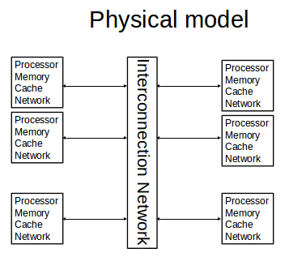
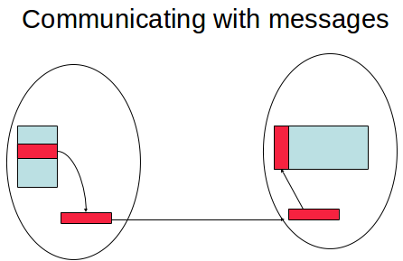
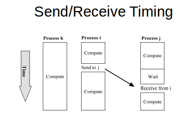

Lecture 13 - MPI Basics
==========
### What is MPI
Message Passing Interface (MPI) is a set of standards for message passing systems.

### Message passing concepts
MPI is defined only at **interface-level**
  * interface-level - if use things defined in .h file then you can combine your code with any other code that uses  the same .h file (same library)
  * link-level - can combine program that has been compiled using some library and link the compiled code with other programs that use other implementations of the same compiled code
  * the key difference is that if you are working with multiple platforms, then a data structure will look very different internally.  At the interface-level, all you are saying is that the data structures on the two systems must be named the same thing. At the link-level, the actual data structures internally must be the same.  
  * thus can't take something in MPI and port it to another platform
  * this means that you have to compile on multiple different programs

nodes are connected by an interconnection network
  * a node has processors and memory
  * n nodes, k processes
  * the k processes are distributed among the n nodes
  * processes are address space disjoint - processes share nothing
  * processes communicate by sending/receiving messages.
  * A message is an array of, possibly typed, bytes
  * May be more than one process per node
  * data coercion - convert data from one format to another
    * you have to do a lot of data coercion to work with multiple nodes since each node can be a completely different platform
    * thus it is really useful to have the bytes be typed as the conversion/coercion becomes much more mainstream

##### physical view

* processors talk amongst each other using interconnection network

##### logical view

  * have processes 0 to (n-1)
  * the processes are fully connected to each other - any process can talk to any other process
  * looks like direct connection logically
  * can send any message to any other node
  * logically there seems to be few limitations and everything seems simple, but this is not the case as seen by the physical view. Still, the above notes logical view features are kept.
    * one of the caveats is that there is usually a limit to how much data can be transferred logically. This allows the physical to not break completely.
    * another caveat is that each machine needs sufficient memory to hold the messages coming into it

  * to get data from left to right
    1. copy data from left to buffer
    2. transport buffer to another machines buffer
    3. other machines buffer copies it over to the right machine
  * there can be more copying going around in this transfer that are not shown
  * if you send directly, then less copying

  * all processes happening in parallel
  * "send to j" -> "receive from i" takes time
  * it is key to understand that the time to transfer the data is very important. If this time is very slow, then it can make the program very slow.

### Basic MPI Pattern
Send(addr destination, char * data, int length)
  * used for sending message
  * destination specifies destination address.
  * data is just a raw pointer to data.
  * length is the size of the data

Send can be
  * Synchronous or asynchronous
    * Synchronous - blocks to until the buffer is full  
    * asynchronous - does not block
      * randez-vous - if you send something and the buffer size is 0, then you cannot proceed until something receives. There is 0 buffer so can't just store it in the buffer.
      * if buffer =1, then you can have 1 message in buffer thus 1 process can quickly just drop off in buffer and forget about it
  * Buffered or unbuffered
    * unbuffered can be beneficial since buffered requires more copying of data. You have to copy from src to buffer and then buffer to dest.
    * thus, buffered is slower
  * Reliable or unreliable
    * MQ and TCP are reliable.
    * UDP/IP not reliable
  * Broadcast or to a particular destination

Receive( addr * source, char * buf, int * length)
  * Blocking or non-blocking
  * Buffered or non-buffered
  * From anyone, or from a particular source

### Example MPI process
Problem: how to get max age among numerous processes

First step is to determine how many tasks there are.
  * you can broadcast and ask who exists. This is slow because you will have 30 choose 2 messages (pairs of 2 from 30)!
  * master/slave - have all processes send to 1 master process
    * requires that all processes know some well known address
  * ring
  * tree

##### initialize MPI
when mpi is run the number of processes is determined and fixed for the lifetimeof the program
  * -mpirun -np 16 myprog
  * mpicc will run mpi programs on rivanna

each process runs a copy of your program (SIMD)

each copy has its own global variables, stack, heap, and PC. It also has MPI library.

For each copy, you want to first call MPI_Init

    MPI_Init (&argc, &argv);

* First MPI function called by each process.
* This is not necessarily first executable statement.
* You need to allow system to do any necessary setup.
* establishes default communicator
* `do not mess with argc and argv before calling MPI_Init`

##### Communicators
Communicator - communication context. this simply provides the message-passing environment for processes to talk to each other
  * default: MPI_COMM_WORLD
  * can create new communicators, but won't for this class
  * a given communicator will be for all processes on system
  * a communicator generally is a subset of all tasks to talk to. MPI_COMM_WORLD is for all tasks

  * default MPI_COMM_WORLD communicator
  * each process is address space disjoint
  * each process has a rank (id)

##### Determine number of processes

    MPI_Comm_size(MPI_COMM_WORLD, &p)

* first arg is communicator
* number of processes is returned through second argument

##### Determine process rank

    MPI_Comm_rank(MPI_COMM_WORLD, &id)

* first arg is communicator
* rank is returned through second argument
* process rank range is 0-(p-1)

##### Shutting down MPI

    MPI_Finalize()

* Call after all other MPI library calls
* Allows system to free up MPI resources (shuts down all hardware channels )

##### Sample program

    #include <stdio.h>
    #include "mpi.h"
    int main(int argc, char * argv[]) {
      // Initialize MPI
      MPI_Init(&argc, &argv);
      // Get the processor number of the current node
      int rank;
      MPI_Comm_rank(MPI_COMM_WORLD, &rank);
      // Get the total number of nodes
      int numNodes;
      MPI_Comm_size(MPI_COMM_WORLD, &numNodes);
      char name[32];
      int length;
      MPI_Get_processor_name(name, &length);
      printf("%s has the rank %d out of %d nodes.\n", name, rank, numNodes);

      //KEY: you will have a lot of processes running. you can attach to a given process and see its output

      fflush();  // Flush all of the output streams
      MPI_Finalize();
    }

We have no clue about what order the print statements will occur

##### MPI_Send

    int MPI_Send (
      void         * message,
      int           count,
      MPI_Datatype  datatype,
      int           dest,
      int           tag,
      MPI_Comm      comm
    )

MPI_Send sends data from one process to another
  * message  - contiguous vector of bytes to send
  * datatype - MPI data type
  * dest - rank of destination
  * tag - optional tag for message. A process can say that it only wants to receive messages with a given tag
  * comm - communicator

The total amount of data that is sent is sizeof(datatype) * amount of objects to send

This is a Synchronous send. You know that the message has been sent when the function returns. Thus, when you return from send, you can use the buffer again.

If this were asynchronous send, then you have to wait until your data is sent.

##### MPI_Recv

    int MPI_Recv (
          void         * message,
          int           count,
          MPI_Datatype  datatype,
          int           source,
          int           tag,
          MPI_Comm      comm,
          MPI_Status   * status
    )

* count - number of data types
* THUS, max amount of memory being sent are: sizeof(datatype) * count

 You can use status field to know whether asynchronous call is done or not.

##### coding send/recieve

    …
    if (ID == j) {
      …
      Receive from I
      …
    }
    …
    if (ID == i) {
      …
      Send to j
      …
    }
    …

`MUST BE IN CORRECT ORDER`. Receive before Send. If you fail to do this, then deadlock will occur.

##### inside MPI_send and MPI_Recv

* left program memory sends data to left system buffer
  * push operation
* left system buffer -> right system buffer
* right system buffer -> right program memory
  * pull operation

##### Return from MPI_Send
Function blocks until message buffer free

Message buffer is free when
  * Message copied to system buffer, or
  * Message transmitted

Typical scenario
  * Message copied to system buffer
  * Transmission overlaps computation

##### return from MPI_Recv
Function blocks until message in buffer

If message never arrives, function never returns

##### Deadlock
KEY: bad code may work on small sample size. the deadlock will likely not occur on small sample size.

Deadlock: process waiting for a condition that will never become true

Easy to write send/receive code that deadlocks. A few ways a deadlock will occur are:
  * Two processes: both receive before send
  * Send tag doesn’t match receive tag
  * Process sends message to wrong destination process
  * Both send large messages to each other first, then receive. Too big for buffers.

### Example, simple, static workload distribution
This is a simple static work distribution with no communication.

##### Circuit satisfiability
Circuit satisfiability is NP-complete. There are no known algorithms to solve in polynomial time. We find through exhaustive search of all possible solutions.

16 inputs -> 65,536 combinations to test

  * this is pleasingly parallel

##### Solution using cyclic (interleaved) allocation
assume p processes  
each process gets every pth piece of work. For example,
* p0: 0,5,10
* p1: 1,6,11
* p2: 2,7
* p3: 3,8
* p4: 4,9

### Homework 4
`VERY HARD`
Start as soon as possible.

hint: It's good to set up a recieve and then check to see if message arrives.

##### Common problems people make in this hw
* processes have to exchange information. do NOT have both processes waiting for each other.
  * you want half of processes to wait, and then other half send
  * if you exchange data sequentially left to right, then things will be super slow - called *zipper*
* we have NO CLUE what the order of the print statements in the program will be

##### Other Tips
* start with 8 processes and work up from there
* want to make sure logic works for boundaries and then
* to get all data in 1 file
  * either figure out offset for each node's content in the file
  * simpler thing, at end of computation, node dumps to file  
* put fflush() after every printf
* it is much cheaper to send a vector than a series of scalars
* when in doubt, minimize number of scalars
* Usually it is just as fast to reduce on vector as on scalar
* all processes **must** get to reduction point. If one of the processes doesn't have this point, then program will deadlock.
* REQUIRED: show time, perfect speed improvement (original time / num processors), and speedup in tables and even charts.
