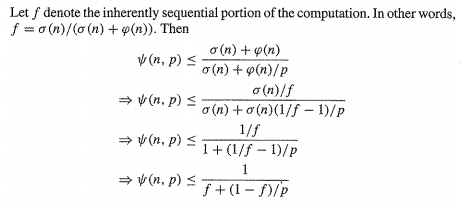
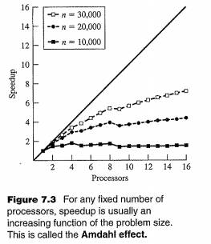
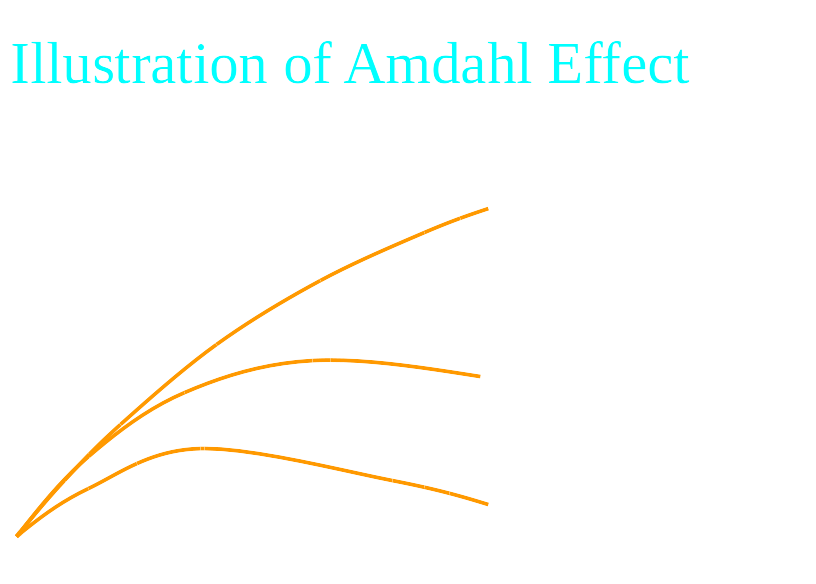
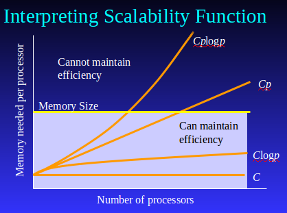

Lecture 7.5 - (Quinn Chapter 7) - Performance Analysis
========================================
It is useful to be able to predict the performance of a parallel algorithm.
Some key things things to know:
* Amdahl's law  - determine whether a program merits parallelization.
* Gustafson-barsis's law  - way to evaluate the performance of a parallel algorithm.
* Karp-Flatt metric  - helps to decide whether the principle barrier to speedup is too much sequential code or parallel overhead.
* The isoefficiency metric  - way to evaluate scalability of a parallel algorithm executing on a parallel computer. It can help to choose the design that will achieve higher performance when the number of processors increases.

## Speedup and Efficiency

*Speedup = sequential execution time / parallel execution time*

The operations performed by a parallel algorithm can be put into three categories:
* Computations that must be done sequentially
* Computations that can be done in parallel
* Parallel overhead (communication operations and redundant computations)

Ψ(n,p) = speedup of some problem of size n on p processors   
σ(n) = sequential portion of the computation
φ(n) = parallel portion of computation
κ(n,p) = time required for parallel overhead
ε(n,p) = Efficiency

A sequential program operating on a *single* processor can only do one computation at a time: σ(n) + φ(n)  
This program does NOT have the κ(n,p) term because it does NOT require any interprocessor communications. In fact, it cannot do any interprocessor communications since it only has 1 processor. Also note that just because you have a single processor does not mean you cannot do any parallel computations - you can use threads.

The best possible parallel execution time occurs when all potential parallel portions of a program are made parallel. There still may be some sequential portions in the program, but it is impossible to make these parallel. These sequential portions take σ(n) time regardless of the number of processors added. In this best case, the portion of computation that can be executed in parallel divides up perfectly among p processors. Thus time needed to perform these operations is φ(n)/p. You then also have in κ(n,p) for interprocessor communication required for the parallel program. Thus, the best case possible with parallel is: φ(n)/p + κ(n,p) + σ(n)  
A key thing to note here is the assumption that the parallel portion of the computation is divided perfectly among the processors. If this is not the case, then you will have larger execution time and thus speedup is smaller.

From this, you can create the speedup inequality:  
  
This inequality is telling us that the speedup will be <= ratio of (largest sequential execution time) / (smallest possible parallel execution)

Communication time increases when you add processors.   Computation time decreases when you add processors.  
There is some optimal point where the two meet. You want to be at that optimal point.

In this picture, the gray/white regions are communication time. The black regions are Computation time. With increasing processors, Communication time increases and Computation time increases. Eventually, the communication time increase over powers the computation time decrease. You want that equilibrium.

The *efficiency* of a parallel program is a measure of processor utilization. We define efficiency to be speedup divided by the number of processors used:  
*Efficiency = speedup/number_of_processors_used*  

When you substitute in the definition of efficiency, you get:  

Efficiency is ε(n,p)

This inequality gives us an upper bounds for efficiency.
The overall bounds for efficiency are: 0 <= ε(n,p) <= 1

## Amdahl's Law

    speedup <= 1/(sequential + parallel/processors)

### Limitations of Amdahl's Law
Amdahl's law ignored overhead associated with introduction of parallelism.

By taking into account the communication time overhead, we realize that Amdahl's law overestimates the speedup.
### The Amdahl Effect

* time required for parallel overhead has lower order of complexity than parallel time / processors
* as n increases, parallel time / processors becomes much more important than parallel overhead
* as n increases, speedup increases

## Gustafson-barsis's Law
predicts scaled speedup

scaled speedup ~ processors + (1-processors) * (% of time in serial code)
## Karp-Flatt Metric
both Amdahl law and Gustafson-barsis law ignore time required for parallel overhead thus overestimate speedup and scaled speedup

single processor execution time = (sequential time + parallel overhead)/(sequential time + parallel time)
single processor execution time = (1/speedup + 1/processors)/(1-1/processors)

features:
* takes into account parallel overhead
* detects other sources of overhead or inefficiency like startup time, synchronization time, imbalanced workload, architectural overhead

You are supposed to calculate single processor execution time for each processor/speedup combination given.

If single processor execution is
* same for all of them (constant) -> large serial fraction is the primary reason for speedup
* increasing with increased processors -> overhead is primary reason for speedup

## Isoefficiency Metric
Parallel system: parallel program executing on a parallel computer

Scalability of a parallel system: measure of its ability to increase performance as number of processors increases

Scalability is when you maintain efficiency as processors are added

Isoefficiency:way to measure scalability

    Isoefficiency relation: T(n,1) >= C*T_0(n,p)

    T(n,1)=sequential time

    C=sime constant

    T_0(n,p) = p * parallel overhead

scalability function: M(f(p))/p

M(n) = memory required for problem of size n

M(f(p))/p shows how memory usage per processor must increase to maintain same efficiency

