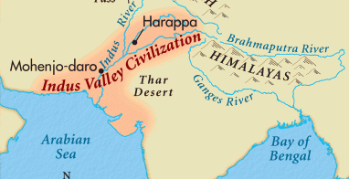
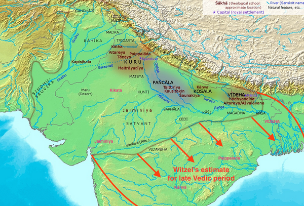

Overview of the History of the Indian subcontinent
===================================================

### Timeline

The history of the Indian subcontinent can be divided into 6 time periods
* early complex societies (3500-2000 BCE)
* Ancient Civilizations (2000-500 BCE)
* Classical Civilizations (500 BCE - 500 CE)
* Post-Classical Civilizations (500-1000 CE)
* Transregional Nomadic Empires (1000-1500 CE)
* Modern Age (1500-present)

### Early Complex Societies (3500-2000 BCE)

##### Stone Age
The earliest Homo erectus remains were found in the Narmada Valley in central India. They date back to 500,000 - 200,000 years ago. This is called the Middle Pleistocene era.

The first confirmed semipermanent settlements appeared 9,000 years ago in Bhimbetka rock shelters in Madhya Pradesh.

Agriculture cultures sprang up
* in Indus Valley region around 5000 BCE
* lower Gangetic valley in 3000 BCE
* southern India

This early civilization spread northwards to Malwa around 1800 BCE and also spread southwards

Locations:
* Indus Valley Civilization is in northwest India (border of India/Pakistan)
* Ganges River is in Northeast India

### Ancient Civilizations (2000-500 BCE)

##### Indus Valley Civilization

The Indus Valley Civilization was centered around the Indus River during 3300 - 1900 BCE. The people were called Harappans.

It's main locations were
* modern day Gujurat, Haryana, Punjab, and Rajasthan
* modern day Pakistan

The key urban centers were
* Dholavira, Kalibangan, Ropar, Rakhigarhi, and Lothal in modern-day India
* Harappa, Ganeriwala, and Mohenjo-daro in modern-day Pakistan

It's key features were
* bronze age
* cities built with rock
* roadside drainage system
* multistoried houses
* municipal system

The civilization started to gradually decline around 1700 BCE. It is unclear why. The cities were simply abandoned overtime.

##### Vedic Period(1500 BCE - 500 BCE)
The Vedic period is when the start of modern day Hindi culture gets started. The Indo-Aryan culture of north-west India sprang up during this time period. The Rigveda (oldest Vedic text and Hindu sacred text) was written during this time. The text describes the culture of this time.

The four varnas, or social classes, sprang up around this time.

Notably, the vedic culture started in north-west India, and then expanded south. With this expansion, the indiginous people of the south became excluded from the culture.

The small tribal units and fiefdoms turned into monarchial, state level polities. As the vedic culture spread, sanskritization started to occur. Sanskritization is people starting to adapt their local culture to religious and social life as described by Brahmanic norms.

**Kuru kingdom**  
The first state-level society of the Vedic society thus became the Kuru kingdom. They are the ones to start the iron age of India. They were in the northern part of the ganges river.

**Panchala kingdom**  
When the Kuru kingdom started to decline, the vedic center of India moved to the Panchala kingdom. It was to the east of the Kuru Kingdom    

**Videha kingdom**  
During the late Vedic period, the Videha kingdom emerged as a new Vedic culture. It was to the east of the Panchala kingdom, in modern day Bihar and Nepal.

The Mahabharata and Ramayana epics both were created during this time.
